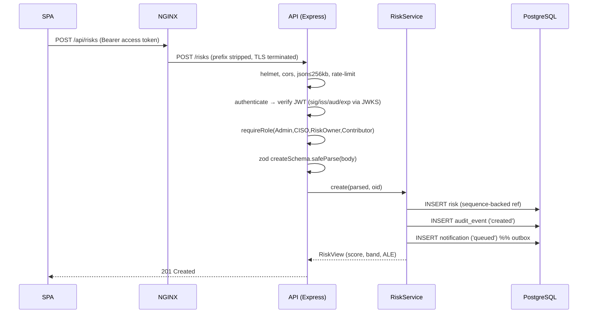
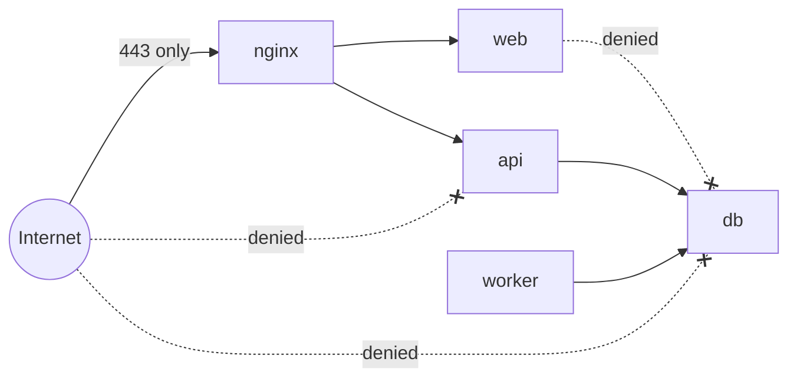
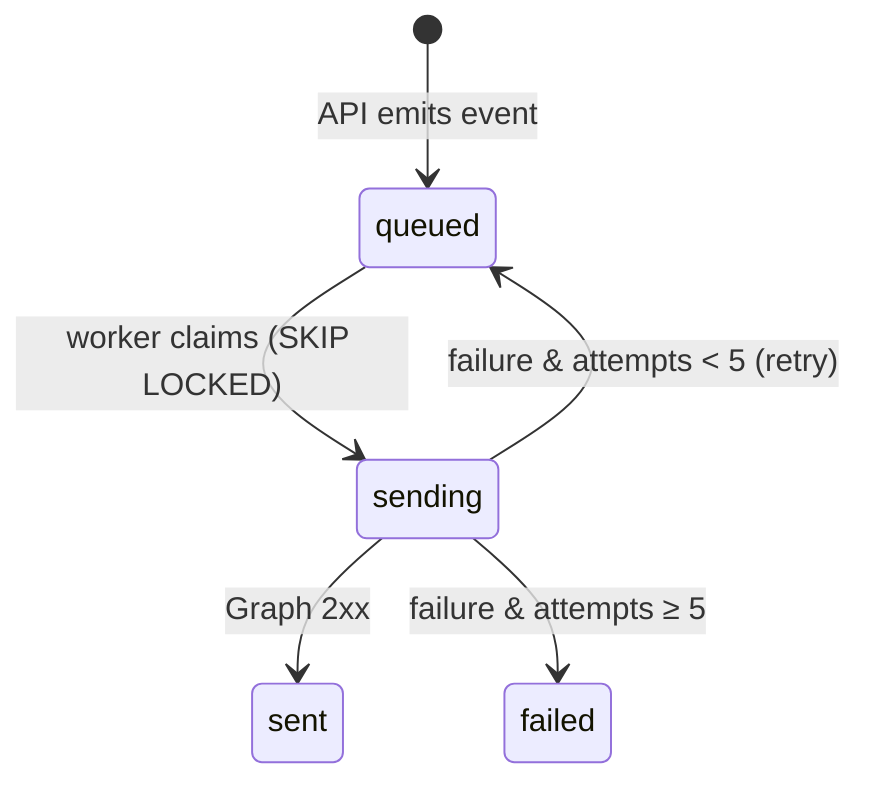
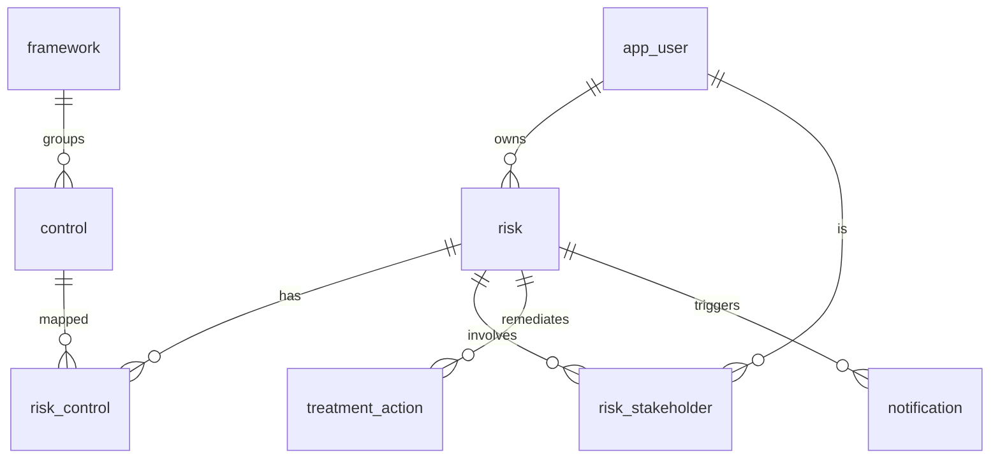

# Architecture

> Enterprise Risk Register Platform — a containerized GRC application built
> **secure-by-design** and **clean-by-design**. This document explains *how* the
> system is put together and *why*. Decisions and their trade-offs are recorded
> separately as [ADRs](adr/README.md); the reusable capabilities are catalogued
> as [Architecture Building Blocks](architecture-building-blocks.md).

---

## 1. Purpose and context

The platform lets a GRC (Governance, Risk & Compliance) team maintain a register
of organizational risks, score them qualitatively (5×5) and quantitatively
(FAIR-style ALE), map them to controls drawn from a multi-framework catalogue
(ISO 27001, NIST, GDPR, NIS2, …), and route notifications to owners and
stakeholders — all under an immutable audit trail and enterprise SSO.

Two principles drive every structural choice:

- **Secure-by-design** — identity is federated (no local passwords), the API
  authorizes *every* request on signed claims *and* object ownership, transport
  is TLS-only, runtime images are non-root/distroless, the network is
  default-deny, and every state change is audited.
- **Clean-by-design** — the API is layered so that business rules do not depend
  on Express, PostgreSQL, or Microsoft Graph. Dependencies point inward; the
  domain is pure and unit-testable without a database.

### System context (C4 level 1)

```mermaid
flowchart LR
  user([GRC user / Risk owner]):::actor
  entra[[Microsoft Entra ID\nOIDC IdP]]:::ext
  graph[[Microsoft Graph\nsendMail]]:::ext
  subgraph platform[Risk Register Platform]
    sys((Web · API · Worker · DB)):::sys
  end
  user -->|"HTTPS (SSO, SPA)"| sys
  sys -->|"validate JWT / JWKS"| entra
  user -.->|"Auth Code + PKCE"| entra
  sys -->|"app-only Mail.Send"| graph
  classDef actor fill:#dbeafe,stroke:#1e40af;
  classDef ext fill:#fef3c7,stroke:#92400e;
  classDef sys fill:#dcfce7,stroke:#166534;
```

---

## 2. Container view (C4 level 2)

Five containers, two trust zones (`frontend`, `backend`). Only the edge is
published; the API is never directly reachable from the host or the internet.

```mermaid
flowchart TB
  subgraph edge[Edge · frontend zone]
    nginx[NGINX\nTLS 1.2/1.3, HSTS, CSP\nreverse proxy]
    web[Web SPA\nReact + Vite + MSAL\nstatic, no secrets]
  end
  subgraph back[backend zone]
    api[API\nNode + Express\nclean architecture]
    worker[Worker\nnotification consumer]
    db[(PostgreSQL 16\nsystem of record\n+ outbox + audit)]
  end
  nginx -->|/api/*  →  strip prefix| api
  nginx -->|/* | web
  api --> db
  worker --> db
  worker --> graph[[MS Graph]]
  api -. validates tokens .-> entra[[Entra ID]]
```

| Container | Tech | Responsibility | Secrets? |
|-----------|------|----------------|----------|
| **web** | React 18 + Vite + MSAL | Presentation only; acquires tokens, calls the API | No — public `VITE_*` only |
| **api** | Node 20 + TypeScript + Express | Stateless domain/application logic, authz, persistence | Yes (DB, Entra audience) |
| **worker** | Node 20 + TypeScript | Drains the notification outbox, sends mail via Graph | Yes (Graph client secret) |
| **db** | PostgreSQL 16 | System of record, outbox queue, append-only audit | n/a |
| **nginx** | NGINX 1.27 | TLS termination, security headers, reverse proxy | TLS key |

See [ADR-0012 (edge)](adr/0012-nginx-edge-tls-termination.md) and
[ADR-0014 (k8s topology)](adr/0014-kubernetes-deployment-topology.md).

---

## 3. The API: clean / hexagonal architecture

The API is the heart of the system and is organized into four concentric layers.
**The dependency rule is strict: source dependencies only ever point inward.**

```
apps/api/src/
├─ domain/          ← pure business rules (no imports of express/pg/jose)
│   ├─ scoring.ts        score, band, ALE, reduction %
│   ├─ risk.ts           Risk entity + toView projection
│   ├─ control.ts        Control entity
│   └─ roles.ts          roles + canModifyRisk() authorization rule
├─ application/     ← use-cases / orchestration
│   ├─ risk.service.ts   create / update / accept / mapControl
│   ├─ events.ts         domain events → outbox
│   └─ errors.ts         HttpError
├─ infrastructure/  ← adapters to the outside world
│   ├─ db.ts             pg Pool
│   ├─ risk.repository.ts  SQL ↔ entity mapping
│   ├─ audit.ts          append-only audit writer
│   └─ auth/entra.ts     JWT verification (jose + JWKS)
└─ interface/       ← delivery mechanism (HTTP)
    ├─ http.ts        app assembly, middleware pipeline, error handler
    ├─ middleware/    authenticate, requireRole, rateLimit
    └─ routes/        risks, controls, frameworks + zod schemas
```

### 3.1 Why the domain stays pure

`domain/scoring.ts` is the canonical example — no framework, no I/O, trivially
testable, and reusable by any tier:

```ts
// apps/api/src/domain/scoring.ts
export function band(s: number): Band {
  if (s >= 15) return 'Critical';
  if (s >= 8)  return 'High';
  if (s >= 4)  return 'Medium';
  return 'Low';
}
/** Annualized Loss Expectancy = SLE × ARO. */
export function ale(sle: number, aro: number): number { return Math.round(sle * aro); }
```

Because this is pure, the test suite exercises real business rules with no
database or HTTP harness:

```ts
// apps/api/src/domain/scoring.test.ts
it('computes ALE = SLE × ARO', () => expect(ale(250_000, 0.5)).toBe(125_000));
```

The authorization *rule* lives in the domain too, as a pure function — so it is
unit-tested in isolation while the *I/O* (resolving the user, throwing 403) stays
in the application layer:

```ts
// apps/api/src/domain/roles.ts
export function canModifyRisk(
  roles: string[], actorUserId: string | null,
  risk: { ownerId?: string; stakeholderIds: string[] }
): boolean {
  if (isElevated(roles)) return true;            // Admin / CISO: any risk
  if (!actorUserId) return false;                // unknown principal: nothing
  return risk.ownerId === actorUserId || risk.stakeholderIds.includes(actorUserId);
}
```

### 3.2 Application layer orchestrates; it does not contain framework code

`RiskService` composes repository, audit, and events. Note it depends on the
*domain* rule and an *infrastructure* repository, but nothing from `interface/`:

```ts
// apps/api/src/application/risk.service.ts
async update(id: string, patch: Partial<Risk>, actor: Actor) {
  const before = await this.repo.findById(id);
  if (!before) return null;
  await this.assertCanModify(actor, before);     // object-level authz (throws 403)
  const after = await this.repo.update(id, patch);
  await audit(this.db, actor.oid, 'modified', 'risk', id, before, after);
  await emit(this.db, { type: 'risk.updated', riskId: id, actorOid: actor.oid,
                        summary: Object.keys(patch).join(', ') });
  return after ? toView(after) : null;
}
```

### 3.3 Infrastructure isolates SQL behind a repository

All SQL is parameterized and confined to `infrastructure/`. The repository maps
rows ↔ entities and hides schema details (snake_case columns, join tables):

```ts
// apps/api/src/infrastructure/risk.repository.ts
async update(id: string, p: Partial<Risk>): Promise<Risk | null> {
  const map = { title:'title', /* … */ status:'status', nextReview:'next_review' };
  const sets: string[] = []; const vals: any[] = [];
  for (const [k, col] of Object.entries(map))
    if (k in p) { vals.push((p as any)[k]); sets.push(`${col}=$${vals.length}`); }
  if (!sets.length) return this.findById(id);
  vals.push(id);
  await this.db.query(`UPDATE risk SET ${sets.join(',')}, updated_at=now()
                        WHERE id=$${vals.length}`, vals);
  return this.findById(id);
}
```

This whitelisting map is also a quiet security control: only known columns can be
written, so a malicious body cannot mass-assign arbitrary fields.

### 3.4 Interface assembles the HTTP delivery mechanism

`buildApp()` wires the middleware pipeline in security-conscious order and
terminates with a single error handler — the one place that turns thrown errors
into responses:

```ts
// apps/api/src/interface/http.ts
app.disable('x-powered-by');
app.use(helmet());
app.use(cors({ origin: env.CORS_ORIGIN }));
app.use(express.json({ limit: '256kb' }));
app.use(pinoHttp({ redact: ['req.headers.authorization', 'req.headers.cookie'] }));
app.use(rateLimit({ windowMs: 60_000, max: 300 }));
// …routes…
const onError: ErrorRequestHandler = (err, req, res, _next) => {
  if (res.headersSent) return;
  if (err instanceof HttpError) return void res.status(err.status).json({ error: err.message });
  req.log?.error({ err }, 'unhandled error');
  res.status(500).json({ error: 'internal error' });
};
app.use(onError);
```

Because Express 4 does not await async handlers, every route is wrapped so a
rejected promise is forwarded to that handler instead of hanging the request:

```ts
// apps/api/src/interface/async-handler.ts
export function asyncHandler(fn) {
  return (req, res, next) => { fn(req, res, next).catch(next); };
}
```

---

## 4. Request lifecycle — `POST /api/risks`

End-to-end trace, showing where each concern is enforced:



Five independent gates run before any business logic: **transport** (NGINX TLS),
**authentication** (`authenticate`), **coarse authorization** (`requireRole`),
**input validation** (Zod), and **resource limits** (body size + rate limit).
This is defense-in-depth — each gate is cheap and fails closed.

---

## 5. Security architecture

### 5.1 Authentication — federated, no local accounts

The SPA performs OIDC Authorization Code + PKCE against Entra ID (MSAL), keeping
tokens in `sessionStorage` (not `localStorage`). The API independently verifies
every access token's signature, issuer, audience and expiry against the tenant
JWKS — it trusts the token, never the SPA:

```ts
// apps/api/src/infrastructure/auth/entra.ts
const { payload } = await jwtVerify(token, jwks,
  { issuer: OIDC_ISSUER, audience: env.ENTRA_API_AUDIENCE });
return { oid: String(payload.oid ?? payload.sub), name: String(payload.name ?? ''),
         roles: Array.isArray(payload.roles) ? payload.roles : [] };
```

### 5.2 Authorization — two layers

1. **Coarse, role-based** (`requireRole`) at the route — deny-by-default; reads
   require *some* recognized role, writes require a write role, and residual-risk
   **acceptance is restricted to Admin/CISO**.
2. **Fine, object-level** (`canModifyRisk`) in the service — a `RiskOwner` or
   `Contributor` may modify only risks they *own* or are a *stakeholder* of;
   Admin/CISO may modify any. This closes the gap where a valid write role could
   otherwise edit *any* risk.

> The UI only *hides*; the API *enforces*. Both layers are server-side.

### 5.3 Auditability — append-only

Every create/modify/approve writes a before/after snapshot to `audit_event`. The
table is append-only **at the database-grant level** — the application's DB role
has `INSERT` only, so the audit trail is tamper-evident even if the app is
compromised:

```ts
// apps/api/src/infrastructure/audit.ts
// Append-only. The DB role granted to the app has INSERT only on audit_event.
await db.query(`INSERT INTO audit_event (actor_oid, action, entity, entity_id, before, after)
                VALUES ($1,$2,$3,$4,$5,$6)`, /* … */);
```

### 5.4 Transport, container and network hardening

- **TLS 1.2/1.3 only**, modern ciphers, HSTS preload, strict CSP at the edge.
- **Distroless, non-root (UID 10001)** runtime images; `readOnlyRootFilesystem`,
  `allowPrivilegeEscalation: false`, all capabilities dropped, `RuntimeDefault`
  seccomp; `automountServiceAccountToken: false`.
- **Default-deny `NetworkPolicy`**; only the API and worker may reach Postgres.
- **Secrets** come from a vault / workload identity in production — never from
  images or `.env`. The SPA pod receives *no* secrets.



---

## 6. Asynchronous notifications — transactional outbox

The API tier never talks to email. Instead it records a domain event as a
`queued` row (an outbox); the worker drains it. This keeps the API fast and
free of email concerns, and survives Graph outages.

```ts
// apps/api/src/application/events.ts — producer
await db.query(`INSERT INTO notification (risk_id, type, recipients, status)
                VALUES ($1, $2, '[]'::jsonb, 'queued')`, [ev.riskId, ev.type]);
```

The worker claims rows **atomically** so multiple replicas never double-send,
retries with bounded attempts, and records the last error for triage:

```ts
// apps/worker/src/notifications.ts — consumer
const { rows: claimed } = await db.query(
  `UPDATE notification SET status='sending', attempts = attempts + 1
    WHERE id IN (SELECT id FROM notification WHERE status='queued'
                 ORDER BY created_at LIMIT 25 FOR UPDATE SKIP LOCKED)
    RETURNING id, risk_id, type, attempts`);
```



See [ADR-0009](adr/0009-async-notifications-outbox-worker.md).

---

## 7. Data model



- `risk` references are minted from a Postgres **sequence** (`risk_ref_seq`),
  not `count(*)` — atomic, no races or reuse.
- `control` is uniquely keyed `(framework, ref)`; the catalogue (ISO 27001 Annex
  A ×93, CIS v8 ×18, NIST CSF 2.0 ×6) is seeded idempotently.
- `audit_event` and `notification` are the immutable log and the outbox.
- Score ranges are enforced by `CHECK (… BETWEEN 1 AND 5)` and statuses by
  Postgres `ENUM`s — invariants live in the schema, not only the app.

---

## 8. Cross-cutting concerns

| Concern | Mechanism | Where |
|---------|-----------|-------|
| Config | `zod`-validated env at boot (fails fast) | `config/env.ts` |
| Input validation | `zod` schemas per route | `interface/routes/*.schemas.ts` |
| Logging | `pino-http` structured logs, auth header **redacted** | `interface/http.ts` |
| Error handling | `asyncHandler` + terminal middleware; typed `HttpError` | `interface/` + `application/errors.ts` |
| Rate limiting | in-memory fixed window (per replica) | `interface/middleware/rate-limit.ts` |
| Health | `/healthz` (liveness), `/readyz` (DB probe) | `interface/http.ts` |

Config validation is intentionally strict — a missing `DATABASE_URL` crashes the
process at startup rather than failing the first request:

```ts
// apps/api/src/config/env.ts
const schema = z.object({ NODE_ENV: z.string().default('development'),
  API_PORT: z.coerce.number().default(8080), DATABASE_URL: z.string(),
  DATABASE_SSL: z.string().default('false').transform(v => v === 'true' || v === '1'),
  /* … */ });
export const env = schema.parse(process.env);
```

---

## 9. Deployment topologies

| | Local (`docker-compose.yml`) | Production (`deploy/k8s/`) |
|---|---|---|
| Edge | NGINX container, self-signed dev cert | Ingress + cert-manager (auto-rotated PKI) |
| Secrets | `.env` file | Vault / KMS via CSI or workload identity |
| Network | two Docker networks | default-deny `NetworkPolicy` |
| DB | `postgres` container, no TLS (`DATABASE_SSL=false`) | managed/TLS Postgres (`DATABASE_SSL=true`) |
| Replicas | 1 each | api ×2, web ×2, worker ×2 |
| Images | built locally, multi-stage | distroless, non-root, from registry |

`npm ci` from a committed lockfile plus multi-stage Docker builds give
reproducible images; the runtime stage ships **production dependencies only**
(dev/test toolchain is pruned), shrinking the attack surface.

---

## 10. Quality attributes & known limitations

**Strengths:** clear separation of concerns; pure, testable domain; defense in
depth; reproducible, hardened builds; tamper-evident audit; horizontally
scalable stateless API and (now-safe) worker.

**Current limitations / roadmap:**

- The event bus is a DB-polling outbox (10 s). Fine at current scale; swap for a
  real broker (Service Bus / SQS) when throughput demands — the `events.ts`
  producer boundary already isolates this change.
- The rate limiter is per-replica/in-memory; move to a shared store (Redis) or
  the ingress for fleet-wide limits.
- App users are expected to exist in `app_user` (Entra-synced); just-in-time
  provisioning on first token is a natural next step.
- The control catalogue ships the headline frameworks in full; regional
  regulations are registered and extended over time.

These are deliberate, documented trade-offs — see the [ADRs](adr/README.md).
```
