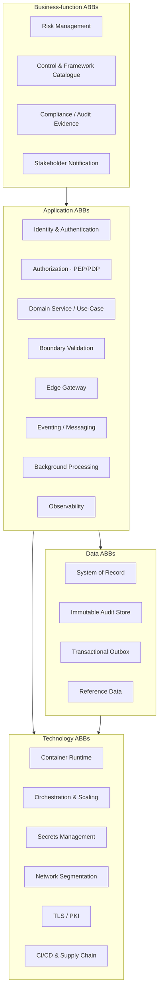

# Architecture Building Blocks (ABBs)

This document **derives Architecture Building Blocks from the Risk Register
platform**. In TOGAF terms, an **ABB** is a *technology-agnostic* description of
a capability and its required characteristics (the "what"), while a **Solution
Building Block (SBB)** is the *concrete implementation* that realizes it (the
"how"). ABBs are reusable across systems; SBBs are product-specific.

We derive ABBs by abstracting each concrete component/decision in this codebase
up to the capability it provides, then record the SBB that realizes it here. The
result is a reference set of building blocks an enterprise could reuse for other
internal applications.



---

## 1. Business-function ABBs

### ABB-B1 — Risk Management Capability
- **Definition:** Capture, score (qualitative & quantitative), treat, review and
  formally accept organizational risks through a governed lifecycle.
- **Required characteristics:** deterministic scoring; enforced status lifecycle;
  segregation of duties on acceptance; every change attributable and audited.
- **Interfaces:** risk CRUD; accept; control mapping.
- **SBB (here):** `domain/scoring.ts` + `domain/risk.ts` (rules), `application/
  risk.service.ts` (use-cases), `risk` table with `CHECK`/`ENUM` invariants.
- **Reuse:** the scoring/banding/ALE sub-block is a standalone, dependency-free
  building block reusable by any risk or assessment tool.

### ABB-B2 — Control & Framework Catalogue
- **Definition:** Maintain a multi-framework catalogue of controls and map them to
  risks for coverage analysis.
- **Required characteristics:** authoritative reference data; uniqueness per
  `(framework, ref)`; custom-control extension; coverage/“mapped” metrics.
- **SBB (here):** `packages/frameworks-data` (framework registry + ISO 27001 Annex
  A ×93, CIS v8 ×18, NIST CSF 2.0), `control`/`risk_control` tables,
  `routes/controls.ts`, `routes/frameworks.ts`.
- **Reuse:** the catalogue package is reusable as enterprise reference data.

### ABB-B3 — Compliance / Audit Evidence
- **Definition:** Produce tamper-evident evidence of who changed what, when —
  satisfying ISO 27001 A.5.28 / A.8.15 and similar.
- **Required characteristics:** append-only; before/after state; immutable at the
  storage layer, not just the application.
- **SBB (here):** `infrastructure/audit.ts` + `audit_event` with `INSERT`-only
  grants ([ADR-0010]).
- **Reuse:** a general audit-evidence building block for any regulated system.

### ABB-B4 — Stakeholder Notification
- **Definition:** Notify accountable people when risks are assigned or materially
  change, reliably and asynchronously.
- **Required characteristics:** decoupled from the request path; at-least-once;
  retry + dead-letter; recipient resolution from identity data.
- **SBB (here):** `application/events.ts` (producer) → `apps/worker` →
  `worker/graph.ts` (MS Graph `sendMail`).

---

## 2. Application ABBs

### ABB-A1 — Identity & Authentication
- **Definition:** Establish a verified principal from a federated IdP without
  storing local credentials.
- **Required characteristics:** standards-based (OIDC); signature/issuer/
  audience/expiry verification; claims-based principal; no secrets in the client.
- **Interfaces:** `verifyToken(token) → Principal`.
- **SBB (here):** MSAL (SPA, Auth Code + PKCE) + `infrastructure/auth/entra.ts`
  (`jose` + JWKS) ([ADR-0006]).
- **Reuse:** drop-in for any internal app on the same IdP.

### ABB-A2 — Authorization (Policy Enforcement / Decision Point)
- **Definition:** Decide whether a principal may perform an action on a resource,
  server-side, deny-by-default.
- **Required characteristics:** coarse role checks **and** fine object-level
  checks; pure, testable decision logic; enforcement separate from decision.
- **Interfaces:** `requireRole(...)` (PEP), `canModifyRisk(...)` (PDP).
- **SBB (here):** `interface/middleware/rbac.ts` + `domain/roles.ts` ([ADR-0007]).
- **Reuse:** `canModifyRisk` is a pure PDP; swappable for OPA/Cedar later.

### ABB-A3 — Domain Service / Use-Case Orchestration
- **Definition:** Coordinate domain rules, persistence, authorization, audit and
  events for a business operation, free of delivery-mechanism concerns.
- **SBB (here):** `application/risk.service.ts` ([ADR-0002]).

### ABB-A4 — Boundary Validation
- **Definition:** Validate and normalize all data crossing a trust boundary
  before it reaches business logic; also validate configuration at boot.
- **SBB (here):** Zod schemas (`routes/*.schemas.ts`, `config/env.ts`)
  ([ADR-0011]).

### ABB-A5 — Edge Gateway
- **Definition:** Single hardened ingress: TLS termination, security headers,
  routing, prefix rewrite; backend never directly exposed.
- **SBB (here):** NGINX (`deploy/nginx/nginx.conf`) / k8s Ingress
  (`deploy/k8s/ingress.yaml`) ([ADR-0012]).

### ABB-A6 — Eventing / Messaging
- **Definition:** Emit domain events for asynchronous consumers, decoupling
  producers from consumers.
- **SBB (here):** `application/events.ts` writing to the outbox ([ADR-0009]).
- **Reuse:** the producer interface is the seam to a real broker later.

### ABB-A7 — Background Processing (Worker)
- **Definition:** Execute work off the request path reliably and idempotently,
  safe under multiple replicas.
- **SBB (here):** `apps/worker` with `FOR UPDATE SKIP LOCKED` claiming + bounded
  retry ([ADR-0009]).

### ABB-A8 — Observability
- **Definition:** Structured, sensitive-data-safe logs and health signals.
- **SBB (here):** `pino-http` with auth-header redaction; `/healthz`, `/readyz`.

---

## 3. Data ABBs

### ABB-D1 — System of Record (Relational Persistence)
- **Definition:** Authoritative, integrity-enforcing transactional store; schema
  carries invariants (constraints, enums, FKs, sequences).
- **SBB (here):** PostgreSQL 16; `db/migrations/*.sql`; repositories in
  `infrastructure/` ([ADR-0005]).

### ABB-D2 — Immutable Audit Store
- **Definition:** Append-only evidence store, immutable at the grant level.
- **SBB (here):** `audit_event` table (INSERT-only role) ([ADR-0010]).

### ABB-D3 — Transactional Outbox / Queue
- **Definition:** Durable, claimable work queue co-located with the system of
  record for reliable async hand-off.
- **SBB (here):** `notification` table (`queued`/`sending`/`sent`/`failed`,
  `attempts`, `last_error`).

### ABB-D4 — Reference Data
- **Definition:** Versioned, authoritative lookup data shared across tiers.
- **SBB (here):** `packages/frameworks-data` (frameworks + control catalogue).

---

## 4. Technology ABBs

| ABB | Definition (tech-agnostic) | SBB (here) | ADR |
|-----|----------------------------|------------|-----|
| **T1 Container Runtime** | Minimal, non-root, immutable runtime per service | Distroless / `nginx-unprivileged`, UID 10001, multi-stage builds | [0013] |
| **T2 Orchestration & Scaling** | Self-healing, horizontally scalable scheduling with health gating | Kubernetes Deployments/StatefulSet, probes, 2× replicas | [0014] |
| **T3 Secrets Management** | Central, rotatable secrets; least-privilege scoping; none in git/images | Vault/KMS via CSI / workload identity; `.env`/`.gitignore` locally | [0015] |
| **T4 Network Segmentation** | Default-deny connectivity; explicit allow-lists | `NetworkPolicy` (only api/worker → db) | [0014] |
| **T5 TLS / PKI** | Encrypted transport; managed, rotated certificates | TLS 1.2/1.3 at edge; cert-manager in cluster | [0012] |
| **T6 CI/CD & Supply Chain** | Reproducible build, lint/test gates, dependency & secret scanning | GitHub Actions (`.github/workflows/ci.yml`), committed lockfile, `npm ci`, prod-dep audit | [0001],[0013] |

---

## 5. ABB → SBB summary map

| Layer | ABB | SBB realization |
|-------|-----|-----------------|
| Business | Risk Management | `domain/scoring.ts`, `risk.service.ts`, `risk` schema |
| Business | Control Catalogue | `frameworks-data`, `control`/`risk_control` |
| Business | Audit Evidence | `audit.ts`, `audit_event` (INSERT-only) |
| Business | Notification | `events.ts` → `worker` → MS Graph |
| Application | Authentication | MSAL + `auth/entra.ts` (jose/JWKS) |
| Application | Authorization | `rbac.ts` (PEP) + `roles.ts` (PDP) |
| Application | Use-Case Orchestration | `risk.service.ts` |
| Application | Validation | Zod (`*.schemas.ts`, `env.ts`) |
| Application | Edge Gateway | NGINX / Ingress |
| Application | Eventing | `events.ts` (outbox producer) |
| Application | Background Processing | `apps/worker` (SKIP LOCKED + retry) |
| Application | Observability | `pino-http` (redacted), health endpoints |
| Data | System of Record | PostgreSQL + migrations + repositories |
| Data | Audit Store | `audit_event` |
| Data | Outbox/Queue | `notification` |
| Data | Reference Data | `frameworks-data` |
| Technology | Runtime/Orch/Secrets/Net/TLS/CICD | distroless, k8s, vault, NetworkPolicy, cert-manager, GH Actions |

---

## 6. Which ABBs are reusable beyond this project

These building blocks are deliberately generic and could seed an internal
**enterprise reference architecture**:

- **A1 Identity & Authentication**, **A2 Authorization**, **A4 Validation**,
  **A5 Edge Gateway**, **A8 Observability** — applicable to *any* internal API.
- **B3 Audit Evidence**, **D2 Immutable Audit Store** — reusable wherever
  compliance evidence is required.
- **A6 Eventing + A7 Background Processing + D3 Outbox** — a portable reliable-
  async pattern.
- **All Technology ABBs (T1–T6)** — the secure-by-default platform substrate.

Project-specific (not generally reusable) SBBs are the **risk domain model** and
the **control catalogue content** — though their *shapes* (a scored domain entity;
versioned reference data) are themselves reusable patterns.
```
